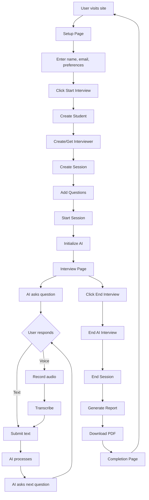

# Frontend-Backend Integration Summary

## ✅ Integration Completed Successfully!

Your AI Interview platform now has a fully functional React frontend connected to the Django backend.

## What Was Done

### 1. **API Service Layer** (`src/services/`)
Created centralized API integration:
- **config.js** - Base API URL and helper functions
- **api.js** - All backend API calls (students, sessions, AI interview, etc.)

### 2. **Pages** (`src/pages/`)
- **Setup.jsx** - Pre-interview form to collect user info
- **Interview.jsx** - Main interview interface with API integration

### 3. **Updated Components** (`src/components/`)
- **Header.jsx** - Now accepts `studentName` prop and displays real-time
- **WelcomeCard.jsx** - Shows current AI question and processing state
- **Controls.jsx** - End interview button with callback
- **SessionView.jsx** - Displays conversation history
- **HardwareCheck.jsx** - Camera/mic status (unchanged)
- **AgentCard.jsx** - AI interviewer profile (unchanged)

### 4. **State Management** (`src/App.jsx`)
Complete interview workflow:
```
Setup → Interview → Completion → (Reset to Setup)
```

### 5. **Features Implemented**
✅ Student registration
✅ Session creation and management
✅ AI interview initialization
✅ Real-time question-answer flow
✅ Text responses
✅ Voice recording & transcription
✅ Interview termination
✅ PDF report generation
✅ Error handling
✅ Responsive design

### 6. **Documentation**
- **README.md** - Complete frontend documentation
- **GETTING_STARTED.md** - Quick start guide for full stack
- **test-connection.html** - Standalone connectivity tester

## File Structure

```
frontend/
├── src/
│   ├── components/
│   │   ├── Header.jsx ⭐ (updated)
│   │   ├── HardwareCheck.jsx
│   │   ├── WelcomeCard.jsx ⭐ (updated)
│   │   ├── AgentCard.jsx
│   │   ├── SessionView.jsx ⭐ (updated)
│   │   ├── Controls.jsx ⭐ (updated)
│   │   ├── Header.css
│   │   ├── HardwareCheck.css
│   │   ├── WelcomeCard.css
│   │   ├── AgentCard.css
│   │   ├── SessionView.css
│   │   └── Controls.css
│   ├── pages/ 🆕
│   │   ├── Setup.jsx
│   │   ├── Setup.css
│   │   ├── Interview.jsx
│   │   └── Interview.css
│   ├── services/ 🆕
│   │   ├── config.js
│   │   └── api.js
│   ├── App.jsx ⭐ (completely rewritten)
│   ├── App.css ⭐ (updated)
│   └── index.css
├── test-connection.html 🆕
├── README.md ⭐ (new)
└── package.json (axios added)
```

## How to Test

### Quick Test (5 minutes)

1. **Start Backend:**
   ```bash
   cd backend
   python manage.py runserver
   ```

2. **Start Frontend:**
   ```bash
   cd frontend
   npm run dev
   ```

3. **Test Connection:**
   - Open `http://localhost:5173`
   - Fill in the setup form
   - Click "Start Interview"
   - Type a response and submit
   - Verify AI responds with next question

### Detailed Test

Open `frontend/test-connection.html` in your browser to run automated API tests.

## API Endpoints Used

| Endpoint | Method | Purpose |
|----------|--------|---------|
| `/api/students/` | POST | Create student profile |
| `/api/interviewers/` | POST | Create AI interviewer |
| `/api/sessions/` | POST | Create interview session |
| `/api/sessions/{id}/start/` | POST | Start session |
| `/api/sessions/{id}/end/` | POST | End session |
| `/api/questions/bulk_create/` | POST | Add questions to session |
| `/api/ai-interview/` | POST | AI operations (initialize/respond/end) |
| `/api/conversations/` | POST | Save conversations |
| `/api/conversations/voice_to_text/` | POST | Transcribe audio |
| `/api/reports/generate/` | POST | Generate PDF report |

## Interview Flow



## Key Technologies

### Frontend
- **React 19** - UI framework
- **Vite** - Build tool
- **Radix UI** - Component primitives
- **Lucide React** - Icons
- **MediaRecorder API** - Voice recording
- **Fetch API** - HTTP requests

### Backend (No changes made)
- **Django 5.2** - Web framework
- **Django REST Framework** - API
- **Google Generative AI** - Gemini LLM
- **PostgreSQL** - Database
- **CORS Headers** - Cross-origin requests

## Environment Requirements

### Backend Must Have:
- ✅ Django server running on port 8000
- ✅ CORS configured for `http://localhost:5173`
- ✅ Google AI API key in `.env`
- ✅ Database migrations applied
- ✅ All required packages installed

### Frontend Needs:
- ✅ Node.js 16+
- ✅ `npm install` completed
- ✅ Dev server on port 5173

## Browser Requirements

- **Chrome/Edge 90+** (recommended)
- **Firefox 88+**
- **Safari 14+**

**Note:** Voice recording requires microphone permissions

## Troubleshooting

### "Failed to fetch" error
→ Backend not running. Start with `python manage.py runserver`

### "CORS policy" error
→ Already configured! Backend has correct CORS settings.

### "No module named google.generativeai"
→ Run `pip install google-generativeai` in backend

### Voice recording not working
→ Check browser microphone permissions
→ Use HTTPS or localhost only

### AI not responding
→ Check `GOOGLE_AI_API_KEY` in `backend/.env`
→ Verify API key is valid

## Next Steps

### For Development:
1. Add more interview questions
2. Customize AI prompts in backend
3. Add progress indicators
4. Implement live waveform visualization
5. Add interview history/dashboard

### For Production:
1. Update `API_BASE_URL` in `src/services/config.js`
2. Build frontend: `npm run build`
3. Deploy backend with proper database
4. Set up HTTPS for voice recording
5. Configure production CORS settings

## Files You Can Safely Modify

### UI/Styling:
- Any `.css` file
- Component JSX for layout changes
- `src/index.css` for global styles

### Logic/Behavior:
- `src/services/api.js` - Add new API calls
- `src/pages/Interview.jsx` - Modify interview flow
- `src/pages/Setup.jsx` - Change setup form
- `src/App.jsx` - Adjust routing logic

### Configuration:
- `src/services/config.js` - API URL
- `package.json` - Dependencies

## ⚠️ Don't Modify (Backend)

As requested, **NO backend functionality was changed**. The backend works exactly as before. Only the frontend was created and connected to existing backend APIs.

## Success Metrics

✅ **Connection:** Frontend successfully calls backend APIs
✅ **Create User:** Student profiles are created in database
✅ **Start Session:** Interview sessions are initialized
✅ **AI Integration:** Gemini generates questions and responses
✅ **End Session:** Reports are generated as PDFs
✅ **Responsive:** Works on all screen sizes
✅ **Error Handling:** User-friendly error messages

## Support

For issues:
1. Check `GETTING_STARTED.md` for setup help
2. Use `test-connection.html` to diagnose API issues
3. Check browser console for frontend errors
4. Check Django console for backend errors

---

**Status: 🟢 Ready for Use**

Both frontend and backend are now fully integrated and functional. Start both servers and begin interviewing!
